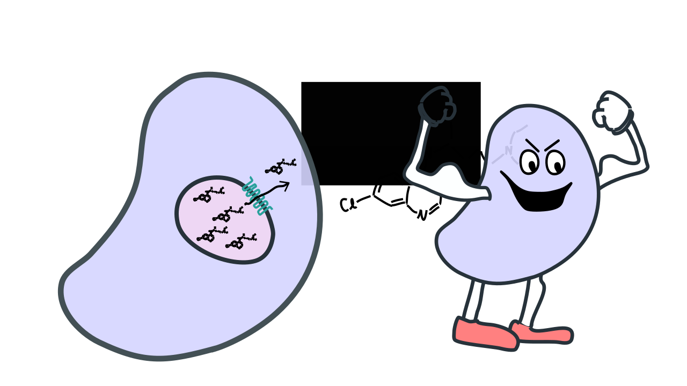

<!-- This is test -->

>>>>>>>>>>>>>>>>>>>>>>>>>>>>>>>>>>

# Proteins evolved

This is amazing.

>>>>>>>>>>>>>>>>>>>>>>>>>>>>>>>>>>

# Evolving proteins must navigate sequence space.

Bar graph showing how overwhelming large sequence space is.

>>>>>>>>>>>>>>>>>>>>>>>>>>>>>>>>>>

# Protein evolution depends on the genotype-phenotype map.

>>>>>>>>>>>>>>>>>>>>>>>>>>>>>>>>>>

<!-- John maynard smith's wordgame -->

>>>>>>>>>>>>>>>>>>>>>>>>>>>>>>>>>>

# How do naturally evolving proteins navigate the genotype-phenotype map?

>>>>>>>>>>>>>>>>>>>>>>>>>>>>>>>>>>

# Introduce rowena's lab.

>>>>>>>>>>>>>>>>>>>>>>>>>>>>>>>>>>

<!-- Intro to PfCRT -->

 10000000000,11000000000,11110000000,10001000000,10001100000,10001111000,10001100000,10000101100,10000101110,10000101111

>>>>>>>>>>>>>>>>>>>>>>>>>>>>>>>>>>

<!-- PfCRT empty network -->

 100000000000,110000000000,111000000000,100110000000,100101000000,100000100000,100000110000,100000111000,100000110100,100101000000,100100000010,100100000001

>>>>>>>>>>>>>>>>>>>>>>>>>>>>>>>>>>

# Can we predict phenotypes in a sparsely sampled genotype-phenotype map?

>>>>>>>>>>>>>>>>>>>>>>>>>>>>>>>>>>

# Our goal:

- General model.
- Fast computation.
- Quality software.

>>>>>>>>>>>>>>>>>>>>>>>>>>>>>>>>>>

## The additive model

- Show math for additive model
- Show Pobs vs Pmodel
- Define epistasis

>>>>>>>>>>>>>>>>>>>>>>>>>>>>>>>>>>

# How do we treat epistasis?

>>>>>>>>>>>>>>>>>>>>>>>>>>>>>>>>>>

# Global epistasis.

Show math for classifier.
Show math for nonlinear function.
Show Pobs vs. Pmodel

cite genetics paper.
cite jakes paper.

>>>>>>>>>>>>>>>>>>>>>>>>>>>>>>>>>>

# Global epistasis is a common feature of genotype-phenotype maps.

Show other maps

>>>>>>>>>>>>>>>>>>>>>>>>>>>>>>>>>>

# Global epistasis improves prediction.

Summarize prediction

>>>>>>>>>>>>>>>>>>>>>>>>>>>>>>>>>>

# What about remaining epistasis?

>>>>>>>>>>>>>>>>>>>>>>>>>>>>>>>>>>

# Local epistasis model.

Show math for pairwise
Show Pobs vs. Pmodel curve.
Show math for high-order
Show Pobs vs. Pmodel curve

>>>>>>>>>>>>>>>>>>>>>>>>>>>>>>>>>>

# Local epistasis is a common feature of genotype-phenotype maps.

Show datasets lined up.

>>>>>>>>>>>>>>>>>>>>>>>>>>>>>>>>>>

# Local epistasis kills prediction

Epistasis makes our predictions worse.

>>>>>>>>>>>>>>>>>>>>>>>>>>>>>>>>>>

# Summarize model steps

red/black chart.

>>>>>>>>>>>>>>>>>>>>>>>>>>>>>>>>>>

# Experimental data sets.

red/black lines for many data sets

>>>>>>>>>>>>>>>>>>>>>>>>>>>>>>>>>>

# Why does epistasis fail?

- Low-order/high-order plot
- High-order epistasis is common.

>>>>>>>>>>>>>>>>>>>>>>>>>>>>>>>>>>

# Where does high-order epistasis come from?

>>>>>>>>>>>>>>>>>>>>>>>>>>>>>>>>>>

# Build simple genotype-phenotype maps from lattice proteins

This is a simple thought experiment.

>>>>>>>>>>>>>>>>>>>>>>>>>>>>>>>>>>

# Lattice proteins exhibit high-order epistasis.

Wait a minute! I thought lattice proteins only have interactions between two sites at a time.

>>>>>>>>>>>>>>>>>>>>>>>>>>>>>>>>>>

# Let's examine a lattice protein over a series of mutations.

>>>>>>>>>>>>>>>>>>>>>>>>>>>>>>>>>>

# Epistasis is a consequence of the ensemble.

>>>>>>>>>>>>>>>>>>>>>>>>>>>>>>>>>>

# Anneliese's experiment.

Lac repressor

>>>>>>>>>>>>>>>>>>>>>>>>>>>>>>>>>>

# How should we treat epistasis?

Uncertainty

>>>>>>>>>>>>>>>>>>>>>>>>>>>>>>>>>>

# How many measurements for 8-site space?

Show

>>>>>>>>>>>>>>>>>>>>>>>>>>>>>>>>>>

# Interesting aside

Not many measurements are needed in general.

>>>>>>>>>>>>>>>>>>>>>>>>>>>>>>>>>>

# 52 Measurements should be enough

>>>>>>>>>>>>>>>>>>>>>>>>>>>>>>>>>>

# Complete predicted map.

Estimated error rate.

>>>>>>>>>>>>>>>>>>>>>>>>>>>>>>>>>>

# Viable trajectories.

XX of XX trajectories are possible.

>>>>>>>>>>>>>>>>>>>>>>>>>>>>>>>>>>

# Conclusions

- Only a few trajectories to drug resistance are possible.
- Many neutral steps were required.
- This main explain why drug resistance took so long to evolve.

>>>>>>>>>>>>>>>>>>>>>>>>>>>>>>>>>>

# More conclusions

- Local epistasis models are the wrong model.
- Epistasis, at this point, is our measure of uncertainty.
- Few measurements are needed to predict
- Software is great.

>>>>>>>>>>>>>>>>>>>>>>>>>>>>>>>>>>

# Future directions

- Variational Auto encoders
- Better global models (ensemble model)

Yet to be done.
Cite Jake's paper.

>>>>>>>>>>>>>>>>>>>>>>>>>>>>>>>>>>

# Acknowledgements.

The Harms lab
