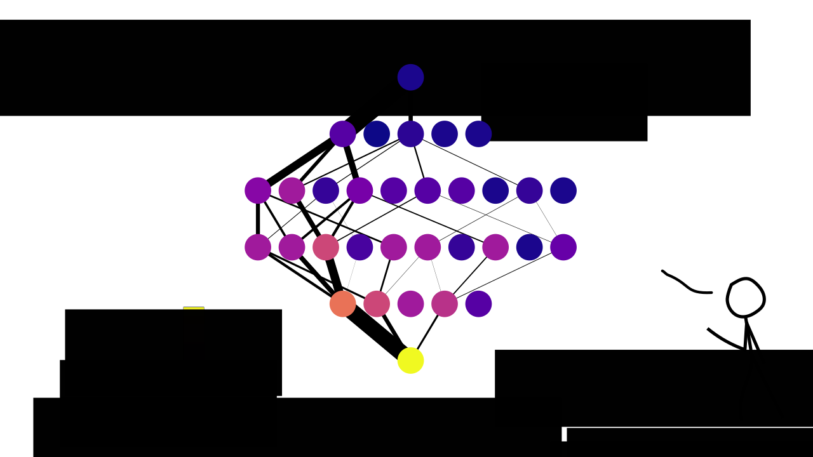
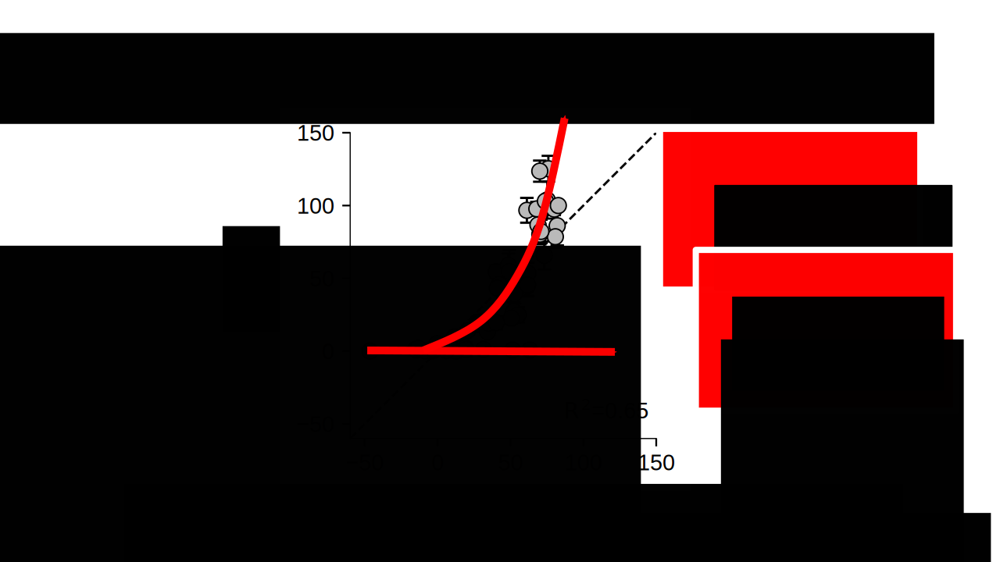
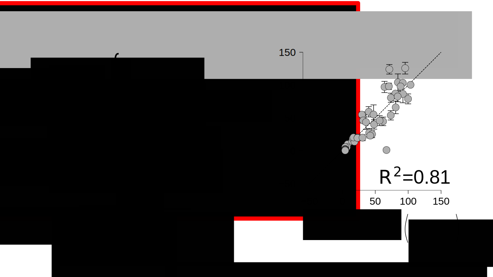
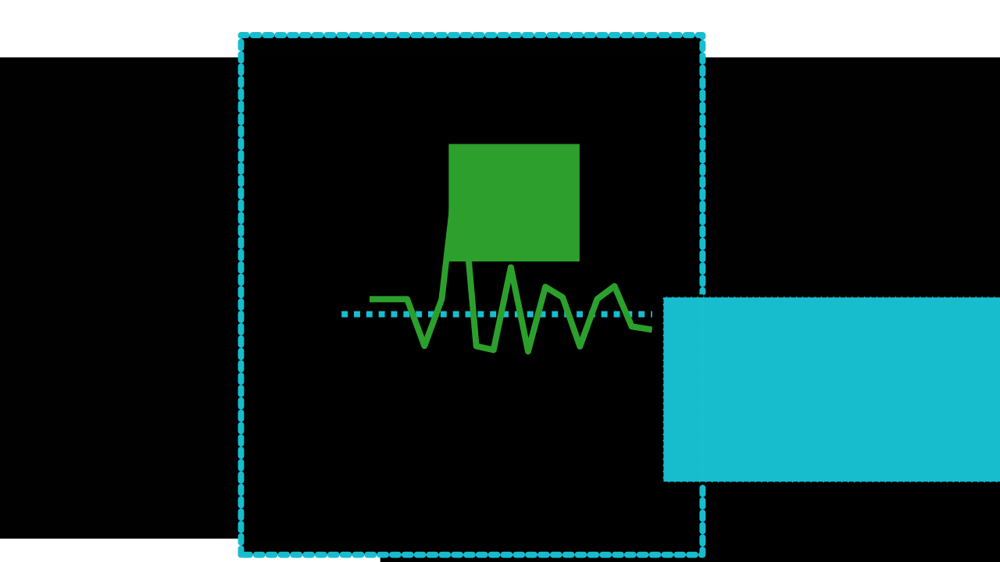
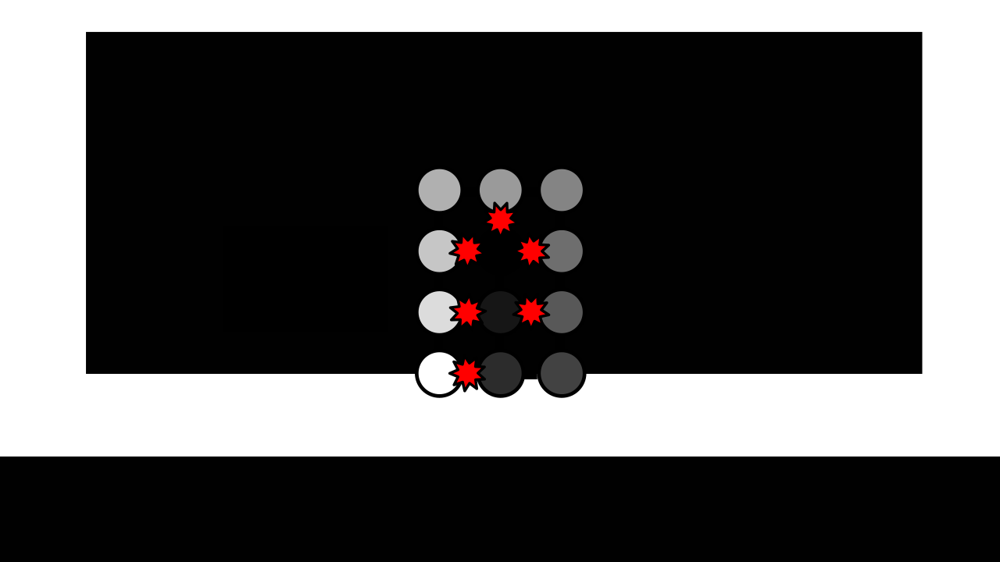
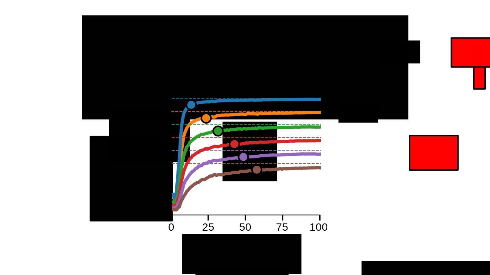

<!-- This is test -->

>>>>>>>>>>>>>>>>>>>>>>>>>>>>>>>>>>

# Proteins evolved

This is amazing.

>>>>>>>>>>>>>>>>>>>>>>>>>>>>>>>>>>

# Evolving proteins must navigate sequence space.

Bar graph showing how overwhelming large sequence space is.

>>>>>>>>>>>>>>>>>>>>>>>>>>>>>>>>>>

# Protein evolution depends on the genotype-phenotype map.

>>>>>>>>>>>>>>>>>>>>>>>>>>>>>>>>>>

<!-- John maynard smith's wordgame -->

>>>>>>>>>>>>>>>>>>>>>>>>>>>>>>>>>>

# How do naturally evolving proteins navigate the genotype-phenotype map?

>>>>>>>>>>>>>>>>>>>>>>>>>>>>>>>>>>

<!-- Intro to PfCRT -->

 10000000000,11000000000,11110000000,10001000000,10001100000,10001111000,10001100000,10000101100,10000101110,10000101111

>>>>>>>>>>>>>>>>>>>>>>>>>>>>>>>>>>

<!-- PfCRT empty network -->

 100000000000,110000000000,111000000000,100110000000,100101000000,100000100000,100000110000,100000111000,100000110100,100101000000,100100000010,100100000001

>>>>>>>>>>>>>>>>>>>>>>>>>>>>>>>>>>

# Can we predict phenotypes in a sparsely sampled genotype-phenotype map?

>>>>>>>>>>>>>>>>>>>>>>>>>>>>>>>>>>

# Our goal:

- General model.
- Fast computation.
- Quality software.

>>>>>>>>>>>>>>>>>>>>>>>>>>>>>>>>>>

 100000000000,110000000000,111000000000,111100000000,111110000000,111111000000,111111100000,111111110000,111111111000,111111111100,100000001110,100000001111

>>>>>>>>>>>>>>>>>>>>>>>>>>>>>>>>>>

 1000,1100,1110,1111

>>>>>>>>>>>>>>>>>>>>>>>>>>>>>>>>>>

 1100000000,1110000000,1111000000,1111100000,1011110000,1011111000,1000011000,1000011100,1000011110,1000000111

>>>>>>>>>>>>>>>>>>>>>>>>>>>>>>>>>>

>>>>>>>>>>>>>>>>>>>>>>>>>>>>>>>>>>

 1100,1110,1101

>>>>>>>>>>>>>>>>>>>>>>>>>>>>>>>>>>

# What about remaining epistasis?

>>>>>>>>>>>>>>>>>>>>>>>>>>>>>>>>>>

 10000000,11110000,11111000,11011100,11011110,11011011

>>>>>>>>>>>>>>>>>>>>>>>>>>>>>>>>>>

>>>>>>>>>>>>>>>>>>>>>>>>>>>>>>>>>>

 11000,11100,11010,11001

>>>>>>>>>>>>>>>>>>>>>>>>>>>>>>>>>>

 100,110,111

>>>>>>>>>>>>>>>>>>>>>>>>>>>>>>>>>>

>>>>>>>>>>>>>>>>>>>>>>>>>>>>>>>>>>

 1000,1100,1110,1111

>>>>>>>>>>>>>>>>>>>>>>>>>>>>>>>>>>

 10,11

>>>>>>>>>>>>>>>>>>>>>>>>>>>>>>>>>>

 10000000,11100000,11110000,11001000,11000100,11000110,11000111

>>>>>>>>>>>>>>>>>>>>>>>>>>>>>>>>>>

 10,11

>>>>>>>>>>>>>>>>>>>>>>>>>>>>>>>>>>

 10000000,11000000,11100000,11110000,11111000,11111100,11111110,11111111

>>>>>>>>>>>>>>>>>>>>>>>>>>>>>>>>>>

## High-order epistasis arises because mutations can affect multiple states in a system simultaneously

>>>>>>>>>>>>>>>>>>>>>>>>>>>>>>>>>>

# Can we observe this experimentally?

(Anneliese's experiment)

>>>>>>>>>>>>>>>>>>>>>>>>>>>>>>>>>>

# High-order epistasis is not useful for prediction.

How should we treat epistasis?

How many genotypes must I measure to reach my best predictions?

>>>>>>>>>>>>>>>>>>>>>>>>>>>>>>>>>>

 10000,11000,11100,11110,11111

>>>>>>>>>>>>>>>>>>>>>>>>>>>>>>>>>>

 1000,1100,1110,1111

>>>>>>>>>>>>>>>>>>>>>>>>>>>>>>>>>>

# Complete predicted map.

Estimated error rate.

>>>>>>>>>>>>>>>>>>>>>>>>>>>>>>>>>>

# Viable trajectories.

XX of XX trajectories are possible.

>>>>>>>>>>>>>>>>>>>>>>>>>>>>>>>>>>

# Conclusions

- Only a few trajectories to drug resistance are possible.
- Many neutral steps were required.
- This main explain why drug resistance took so long to evolve.

>>>>>>>>>>>>>>>>>>>>>>>>>>>>>>>>>>

# More conclusions

- Local epistasis models are the wrong model.
- Epistasis, at this point, is our measure of uncertainty.
- Few measurements are needed to predict
- Software is great.

>>>>>>>>>>>>>>>>>>>>>>>>>>>>>>>>>>

# Future directions

- Variational Auto encoders
- Better global models (ensemble model)

Yet to be done.
Cite Jake's paper.

>>>>>>>>>>>>>>>>>>>>>>>>>>>>>>>>>>

# Acknowledgements.

The Harms lab
