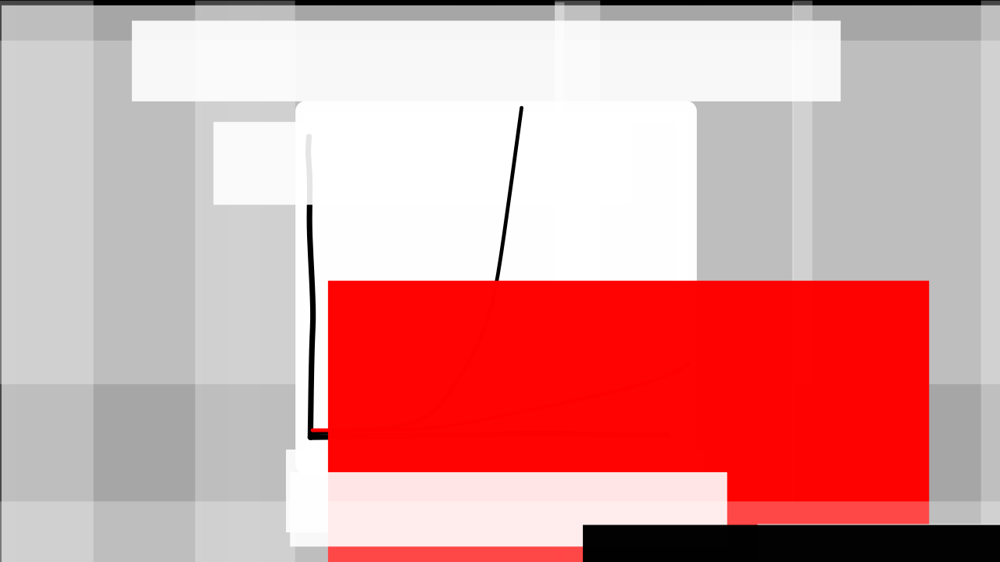
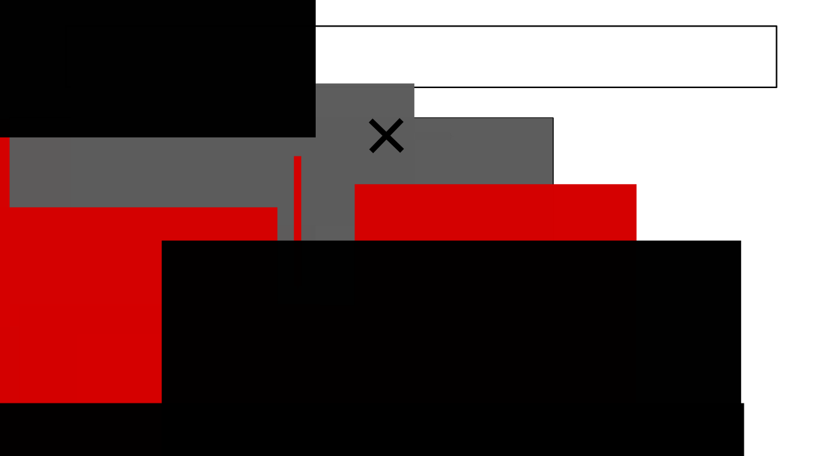
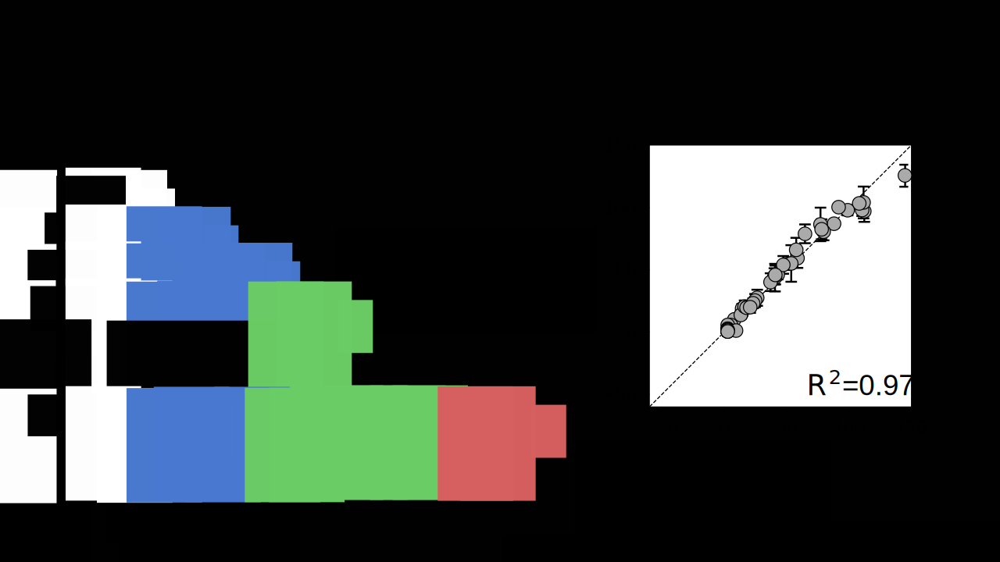
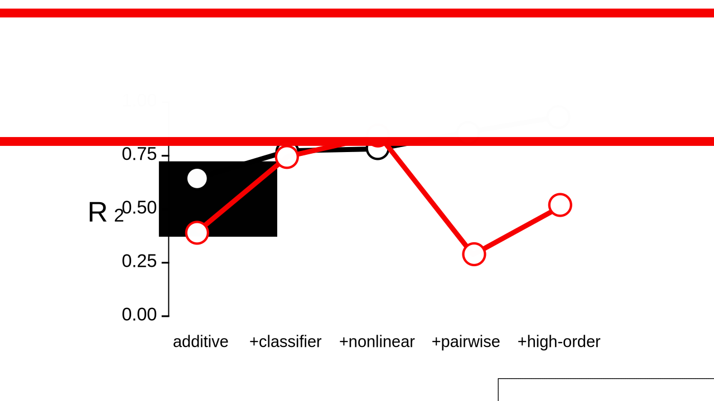

<!-- This is test -->

>>>>>>>>>>>>>>>>>>>>>>>>>>>>>>>>>>

# Proteins evolved.

(Show a diverse set of proteins with cool functions)

This is amazing.

>>>>>>>>>>>>>>>>>>>>>>>>>>>>>>>>>>

 111100001,111110001,111111001,111111101,111111111

>>>>>>>>>>>>>>>>>>>>>>>>>>>>>>>>>>

<!-- Protein evolution depends on the genotype-phenotype map. (wordgame) -->

 1110000000,1111000000,1110100000,1110010000,1110001000,1110000100,1010000010,0010000011

>>>>>>>>>>>>>>>>>>>>>>>>>>>>>>>>>>

<!-- questions -->

>>>>>>>>>>>>>>>>>>>>>>>>>>>>>>>>>>

<!-- Genotype-phenotypes maps are intractable. -->

>>>>>>>>>>>>>>>>>>>>>>>>>>>>>>>>>>

>>>>>>>>>>>>>>>>>>>>>>>>>>>>>>>>>>

<!-- Outline talk -->

>>>>>>>>>>>>>>>>>>>>>>>>>>>>>>>>>>

<!-- Intro to PfCRT -->

 10000000000,11000000000,11100000000,11110000000,10001000000,10001100000,10001110000,10001111000,10001111100,10001111110,10000101111

>>>>>>>>>>>>>>>>>>>>>>>>>>>>>>>>>>

<!-- PfCRT empty network -->

 110000,111000,100110,100101

>>>>>>>>>>>>>>>>>>>>>>>>>>>>>>>>>>

<!-- Introduce collaboration -->

 1000000,1100000,1010000,1011000,1011100,1011110,1011111

>>>>>>>>>>>>>>>>>>>>>>>>>>>>>>>>>>

<!-- Introduce collaboration -->

 11100,11010,11001

>>>>>>>>>>>>>>>>>>>>>>>>>>>>>>>>>>

>>>>>>>>>>>>>>>>>>>>>>>>>>>>>>>>>>

 1100000000000,1111000000000,1111110000000,1111111000000,1111111100000,1111111110000,1110101111000,1100000001100,1100000001110,1100000001111

>>>>>>>>>>>>>>>>>>>>>>>>>>>>>>>>>>

 110,111

>>>>>>>>>>>>>>>>>>>>>>>>>>>>>>>>>>

>>>>>>>>>>>>>>>>>>>>>>>>>>>>>>>>>>

 11000000000,11110000000,11111000000,11111110000,11111111000,11111111100,11111111110,11111111111

>>>>>>>>>>>>>>>>>>>>>>>>>>>>>>>>>>

 11000,11100,11110,11111

>>>>>>>>>>>>>>>>>>>>>>>>>>>>>>>>>>

 11100000000000,11111000000000,11111100000000,11111110000000,11111111000000,11111100100000,11111100110000,11111100111000,11111100111100,11110000011101

>>>>>>>>>>>>>>>>>>>>>>>>>>>>>>>>>>

>>>>>>>>>>>>>>>>>>>>>>>>>>>>>>>>>>

 11000,11100,11010,11011

>>>>>>>>>>>>>>>>>>>>>>>>>>>>>>>>>>

<!-- How should we treat the remaining epistasis -->

>>>>>>>>>>>>>>>>>>>>>>>>>>>>>>>>>>

<!-- Should we add a high-order model? -->

<!-- Is epistasis common in experimental maps -->

>>>>>>>>>>>>>>>>>>>>>>>>>>>>>>>>>>

<!-- High-order epistasis is ubiquitous in experimental maps -->

 110,111

>>>>>>>>>>>>>>>>>>>>>>>>>>>>>>>>>>

<!-- Do they matter for evolution? -->

 1100000000000,1111111000000,1111111100000,1100001100000,1100001010000,1100011011000,1100111011100,1101111011110,1111111011111

>>>>>>>>>>>>>>>>>>>>>>>>>>>>>>>>>>

>>>>>>>>>>>>>>>>>>>>>>>>>>>>>>>>>>

 11000,11100,11010,11001

>>>>>>>>>>>>>>>>>>>>>>>>>>>>>>>>>>

 100,110,111

>>>>>>>>>>>>>>>>>>>>>>>>>>>>>>>>>>

 10,11

>>>>>>>>>>>>>>>>>>>>>>>>>>>>>>>>>>

<!-- Intro to ensembles -->

>>>>>>>>>>>>>>>>>>>>>>>>>>>>>>>>>>

<!-- Ensemble double mutant cycle -->

>>>>>>>>>>>>>>>>>>>>>>>>>>>>>>>>>>

 1000000,1100000,1110000,1101000,1100100,1100110,1100101

>>>>>>>>>>>>>>>>>>>>>>>>>>>>>>>>>>

## High-order epistasis arises because mutations can affect multiple states in a system simultaneously

>>>>>>>>>>>>>>>>>>>>>>>>>>>>>>>>>>

# Can we observe this experimentally?

(Anneliese's experiment)

>>>>>>>>>>>>>>>>>>>>>>>>>>>>>>>>>>

Any system that involves a collection of states will likely exhibit high-order epistasis.

>>>>>>>>>>>>>>>>>>>>>>>>>>>>>>>>>>

<!-- How should we treat epistasis -->

 11000,11100,11110,11111

>>>>>>>>>>>>>>>>>>>>>>>>>>>>>>>>>>

# The best model.

>>>>>>>>>>>>>>>>>>>>>>>>>>>>>>>>>>

>>>>>>>>>>>>>>>>>>>>>>>>>>>>>>>>>>

>>>>>>>>>>>>>>>>>>>>>>>>>>>>>>>>>>

 10000,11000,10100,10010,10001

>>>>>>>>>>>>>>>>>>>>>>>>>>>>>>>>>>

# Conclusions

- Only a few trajectories to drug resistance are possible.
- Many neutral steps were required.
- This main explain why drug resistance took so long to evolve.

>>>>>>>>>>>>>>>>>>>>>>>>>>>>>>>>>>

# More conclusions

- Developed a general model for predicting sparsely sampled genotype-phenotype maps.
- The software is fast, high-quality, free, open source, and includes documentation.
-

>>>>>>>>>>>>>>>>>>>>>>>>>>>>>>>>>>

# Future directions

- Better models for decomposing global epistasis (ensemble model)
- Add Jake's citation

>>>>>>>>>>>>>>>>>>>>>>>>>>>>>>>>>>

>>>>>>>>>>>>>>>>>>>>>>>>>>>>>>>>>>

>>>>>>>>>>>>>>>>>>>>>>>>>>>>>>>>>>

>>>>>>>>>>>>>>>>>>>>>>>>>>>>>>>>>>

>>>>>>>>>>>>>>>>>>>>>>>>>>>>>>>>>>

>>>>>>>>>>>>>>>>>>>>>>>>>>>>>>>>>>

>>>>>>>>>>>>>>>>>>>>>>>>>>>>>>>>>>

# Questions?
